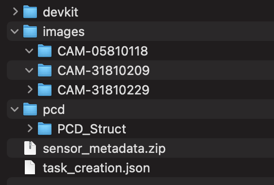

# Sama Solution Engineering Technical Excercise

At Sama we provide [training data](https://www.samasource.com/blog/2017/12/18/what-is-training-data) for computer vision models. Whether we're dealing with [image annotation applications](https://www.samasource.com/blog/2018/12/04/training-your-ai-in-3d), metrics to benchmark how well our services perform, or tools to help integrate customer data pipelines, reporting and working with images is part of our DNA.

## Exercise 1 (Architecture & Design)

We anticipate this exercise should take about a couple hours. We are more interested in your approach than perfection. 

Write a program in python that takes the given json file (Question_1.json) as input. The json describes the annotations made on images. Output a list of errors found in the annotations.

List of validations:
- All quads and points should be grouped such that a group contains one quad and one point
- Each quad shape should have exactly four corners
- The corners of the quad shape should be marked in clockwise order starting from the top left corner. If any of the corners are marked occluded then ignore this check.
- There should be only one triangle
- Triangles should not be grouped
- Triangles and points should not have occlusion values

If you think of any validations that you would add to this list, please add them.

## Exercise 2 (Format manipulation)

In the Question_2_Sequences folder, scan each folder to identify the data.json file for each sequence. You will need to parse it can generate JSON files to represent sensor metadata for each frame and a task creation JSON to point to different sensor folders. The script should run as to generate all these files for each sequence.
<br><br>

### Sensor Metadata (sensor_metadata.zip)
- Create sensor metadata files (JSON) for each pcd file present per sequence. 

In the data.json file, extract information to create the JSONs in the following structure (ex: 1643241862102373008.json):

```json
{
  "x": 672844.2950143164,
  "y": 4010748.2882388034,
  "z": 0.0,
  "rotation_x": 0.0,
  "rotation_y": 0.0,
  "rotation_z": 0.110562562888093,
  "rotation_w": 0.9938691662827741
}
```

Once all the JSONs are created, zip them together (name of zip: sensor_metadata.zip) and store the zip as shown in the expetec file structure image. Clean up any residual JSONs from this process.

#### Tips & Hints:
```
odom
    orientation = rotation
    position = direct mapping
```
<br><br>


### Task Creation (task_creation.zip)
- In the data.json, identify which unique identifier is related to center/left/right camera. With this identifier, identify which camera image folder to reference for each camera. Then create a JSON file (name of file: task_creation.json) poiting to the following folders:

```json
[
    "data": {
        "CloudURL": <Path to the folder cointaining the PCD files>,
        "LeftCamera": <Path to the folder cointaining Left Camera Files>,
        "RightCamera": <Path to the folder cointaining Right Camera Files>,
        "CenterCamera": <Path to the folder cointaining Center Camera Files>,
        "SensorMetadata": <Path to Zip metadata>
    }
]
```

Store the file as shown on the expected file structure for each sequence
<br><br>


## Example of expected file structure: <br />




## General instructions

Please clone this repository and share the response with abha2 and yanndonn

Best of luck!